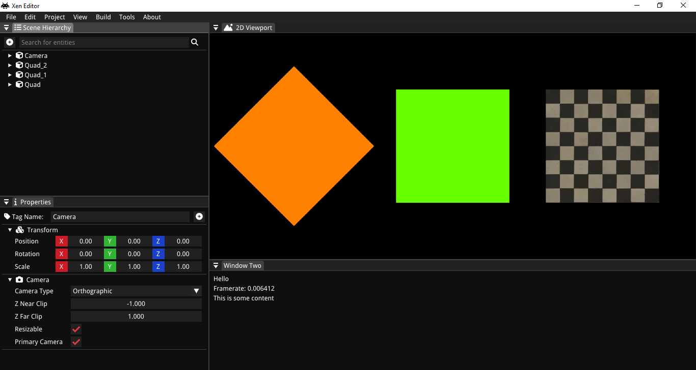

# Xenode

Xenode is a cross platform game engine that works primarily works in Windows and Linux.

## Building Xenode
Xenode has a lot of dependencies that needs to cloned properly for a successful build. Follow the instructions below to build Xenode for the Xenode is officially tested for MSVC for Windows and GCC for Linux

## Requirements
* x64 based processor
* GPU with atleast OpenGL 3.0 support for better experience

### For Windows
Visual Studio 2022 recommended  
1. Clone the repository recursively: `git clone --recursive https://github.com/shreyaspranav/Xenode.git`
2. Go to the cloned directory and run `premake-windows vs2022`
3. All the .sln and .vcxproj files will the generated, open Visual Studio and compile them or open Developer Command Prompt for VS2022 and run `msbuild Xenode.sln` 

### For Linux
1. Clone the repository recursively: `git clone --recursive https://github.com/shreyaspranav/Xenode.git`
2. Go to the cloned directory and run `premake-linux vs2022`
3. All Makefiles will be generated, run `make` to build the project

## What's Present in Xenode?
As of time of writing, Xenode has a fast 2D Batch Renderer which supports rendering quads and circles. It can render thousands of colored quads in a single draw call. It also has a level editor made in [ImGui](https://github.com/ocornut/imgui) and is dockable. It also has a demo FlappyBird game made with this engine in SandboxApp project.

## Dependencies
* [GLFW](https://github.com/glfw/glfw) for windows and input
* [glad](gen.glad.sh) for OpenGL Function loading
* [spdlog](https://github.com/gabime/spdlog) for logging
* [glm](https://glm.g-truc.net/0.9.9/index.html) for math 
* [ImGui](https://github.com/ocornut/imgui) for debug windows and Level Editor
* [stb_image](https://github.com/nothings/stb/blob/8b5f1f37b5b75829fc72d38e7b5d4bcbf8a26d55/stb_image.h) for texture loading
* [entt](https://github.com/skypjack/entt) for ECS(Entity Component System)
* [yaml-cpp](https://github.com/jbeder/yaml-cpp) for serialisation
* [taskflow](https://github.com/taskflow/taskflow) for parallel execution
* [freetype](https://github.com/freetype/freetype) for font loading

## Plan
To make a cross platform 3D and 2D game engine and ship a production level game in the near future.

### Things to implement in the game engine in the near future
* Text rendering
* 2D particle system
* 2D lighting and shadows
* Serialisation of scenes
* Scripting system
* Asset manager and content manager
* UI Library
* Support for joysticks
* Mac support
